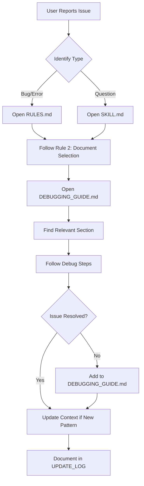
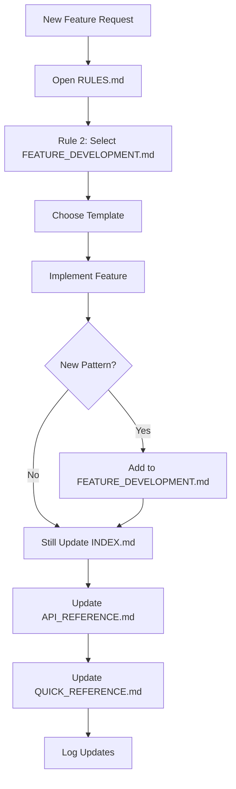
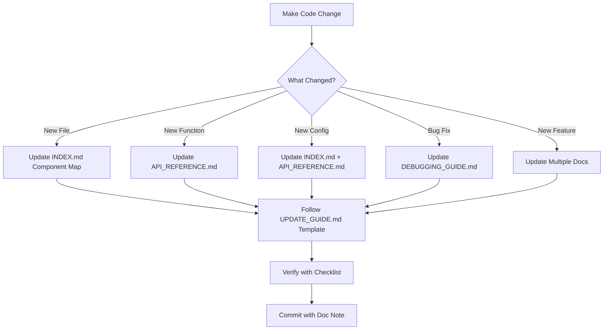

# Context Management System - Complete Guide

**Purpose:** Comprehensive guide to using and maintaining the Verbal project context

**Version:** 2.0  
**Last Updated:** 2026-06-30

---

## 🎯 Overview

The Verbal project context is a comprehensive documentation system designed to:

1. **Accelerate debugging** - Systematic approaches to common issues
2. **Streamline feature development** - Proven templates and patterns
3. **Preserve knowledge** - Capture architectural decisions and solutions
4. **Enable AI assistance** - Structured context for AI helpers

---

## 📚 Complete Document Index

### Primary Documents (Usage)

| Document | Purpose | Audience | Priority |
|----------|---------|----------|----------|
| [INDEX.md](./INDEX.md) | Complete project navigation | Everyone | ⭐⭐⭐ |
| [SKILL.md](./SKILL.md) | Structured workflows | Developers, AI | ⭐⭐⭐ |
| [QUICK_REFERENCE.md](./QUICK_REFERENCE.md) | Daily cheat sheet | Everyone | ⭐⭐ |
| [API_REFERENCE.md](./API_REFERENCE.md) | API documentation | Developers | ⭐⭐ |

### Primary Documents (Maintenance)

| Document | Purpose | Audience | Priority |
|----------|---------|----------|----------|
| [RULES.md](./RULES.md) | **Mandatory** usage/update rules | AI, Developers | ⭐⭐⭐ |
| [UPDATE_GUIDE.md](./UPDATE_GUIDE.md) | Step-by-step update instructions | Developers | ⭐⭐⭐ |
| [README.md](./README.md) | System overview | New users | ⭐⭐ |

### Specialized Documents

| Document | Purpose | Audience | When to Use |
|----------|---------|----------|-------------|
| [DEBUGGING_GUIDE.md](./DEBUGGING_GUIDE.md) | Troubleshooting guide | Debugging issues | When bugs occur |
| [FEATURE_DEVELOPMENT.md](./FEATURE_DEVELOPMENT.md) | Implementation patterns | Adding features | When building new |
| [AGENT_INSTRUCTIONS.md](./AGENT_INSTRUCTIONS.md) | AI assistant guide | AI systems | AI interactions |
| [SETUP_SUMMARY.md](./SETUP_SUMMARY.md) | What was created | Understanding system | First-time setup |

---

## 🔄 Complete Workflow

### Workflow 1: Debugging an Issue



**Steps:**
1. Identify the issue type (recording, transcription, sync, etc.)
2. Open RULES.md → Rule 2 → Document Selection Matrix
3. Navigate to appropriate debugging section
4. Follow systematic debug steps
5. If new pattern discovered → Update DEBUGGING_GUIDE.md
6. Log the update

---

### Workflow 2: Adding a Feature



**Steps:**
1. Open RULES.md → Rule 2 → Feature Development
2. Select appropriate template from FEATURE_DEVELOPMENT.md
3. Implement following the template
4. Update INDEX.md (Component Map, Key Files, etc.)
5. Update API_REFERENCE.md (new modules, functions)
6. Update QUICK_REFERENCE.md (if relevant)
7. Log all updates

---

### Workflow 3: Making Code Changes



**Steps:**
1. Identify what changed (see UPDATE_GUIDE.md decision tree)
2. Open UPDATE_GUIDE.md → Relevant Template
3. Update appropriate documents
4. Use UPDATE_GUIDE.md → Update Checklist
5. Verify quality and completeness
6. Commit with note about documentation updates

---

## 📋 Rule Summary (from RULES.md)

### The 12 Rules

1. **Always Use Context** - Mandatory for debugging, feature dev, understanding
2. **Use Right Document** - Follow Document Selection Matrix
3. **Update Triggers** - Know when to update (code changes, bug fixes, etc.)
4. **Update Workflow** - 4-step process: Identify → Determine → Update → Verify
5. **Usage Workflow** - Before, during, after tasks
6. **Quality Standards** - Accuracy, completeness, clarity, examples
7. **AI Guidelines** - How AI should use and reference context
8. **Maintenance Schedule** - Weekly, monthly, post-release reviews
9. **Metrics** - Track coverage, accuracy, usage, freshness
10. **Enforcement** - Automatic checks and review checklist
11. **Templates** - Standard formats for updates
12. **Decision Tree** - Quick reference for when to use/update

### Critical Rules (Must Follow)

**Rule 1: Mandatory Context Usage**
- MUST use context for all Verbal-related debugging
- MUST use context for all feature development
- MUST use context for code understanding

**Rule 3: Update Triggers**
- MUST update when creating new files
- MUST update when adding functions/classes
- MUST update when fixing bugs
- MUST update when adding features
- MUST update when changing config

**Rule 10: Enforcement**
- MUST verify context updated before committing code
- MUST use update checklist
- MUST check all affected documents

---

## 🎯 Quick Decision Trees

### "Which Document Should I Use?"

```
Task Type?
├─ Debugging → DEBUGGING_GUIDE.md
│               └─ Also: SKILL.md (workflow), INDEX.md (component location)
│
├─ Feature Dev → FEATURE_DEVELOPMENT.md
│                └─ Also: SKILL.md (workflow), INDEX.md (affected components)
│
├─ Understanding → INDEX.md
│                  └─ Also: API_REFERENCE.md (APIs), QUICK_REFERENCE.md (quick facts)
│
├─ Quick Lookup → QUICK_REFERENCE.md
│                 └─ Also: INDEX.md (more details)
│
└─ Making Changes → UPDATE_GUIDE.md
                    └─ Also: RULES.md (requirements)
```

### "Which Documents Should I Update?"

```
Change Type?
├─ New File → INDEX.md (Component Map, Key Files)
│             └─ Also: API_REFERENCE.md (if public APIs)
│
├─ New Function → API_REFERENCE.md
│                 └─ Also: INDEX.md (if major component)
│
├─ Bug Fix → DEBUGGING_GUIDE.md
│            └─ Also: INDEX.md (if known issue)
│
├─ New Feature → INDEX.md (all relevant sections)
│                └─ Also: API_REFERENCE.md, FEATURE_DEVELOPMENT.md
│
├─ Config Change → INDEX.md + API_REFERENCE.md
│
└─ Build Change → INDEX.md (Build section)
                  └─ Also: DEBUGGING_GUIDE.md (Build troubleshooting)
```

---

## 📊 Context Usage Matrix

### By Role

| Role | Primary Documents | Secondary Documents |
|------|-------------------|---------------------|
| **Developer** | INDEX.md, QUICK_REFERENCE.md | API_REFERENCE.md, UPDATE_GUIDE.md |
| **AI Assistant** | SKILL.md, RULES.md, AGENT_INSTRUCTIONS.md | All docs as needed |
| **Debugger** | DEBUGGING_GUIDE.md, SKILL.md | INDEX.md, API_REFERENCE.md |
| **Feature Builder** | FEATURE_DEVELOPMENT.md, SKILL.md | INDEX.md, API_REFERENCE.md |
| **Maintainer** | RULES.md, UPDATE_GUIDE.md | All docs |
| **New User** | README.md, INDEX.md, QUICK_REFERENCE.md | SKILL.md |

### By Task

| Task | Open First | Then Open | Finally Update |
|------|-----------|-----------|----------------|
| Fix recording bug | DEBUGGING_GUIDE.md §1 | INDEX.md → Recorder | DEBUGGING_GUIDE.md (solution) |
| Add API integration | FEATURE_DEVELOPMENT.md → Template 1 | INDEX.md → APIs | INDEX.md, API_REFERENCE.md |
| Understand sync | INDEX.md → Supabase | API_REFERENCE.md → SyncClient | (no update needed) |
| Create mobile screen | FEATURE_DEVELOPMENT.md → Template 2 | INDEX.md → Mobile | INDEX.md, QUICK_REFERENCE.md |
| Fix build error | DEBUGGING_GUIDE.md §5 | INDEX.md → Build | DEBUGGING_GUIDE.md (solution) |

---

## 🔍 Search Strategies

### Finding Information

**Strategy 1: Known Component**
```
1. Open INDEX.md
2. Ctrl+F for component name
3. Navigate to section
4. Check cross-references
```

**Strategy 2: Unknown Component**
```
1. Open INDEX.md
2. Go to Component Map
3. Find by purpose
4. Follow to file location
```

**Strategy 3: Debugging Issue**
```
1. Open DEBUGGING_GUIDE.md
2. Find issue type in table of contents
3. Follow debug steps
4. Check related sections
```

**Strategy 4: API Lookup**
```
1. Open API_REFERENCE.md
2. Find module name
3. Locate function/class
4. Review signature and example
```

---

## 📝 Update Templates

### Quick Update Template

For fast updates (5 minutes or less):

```markdown
## Update: [Feature/Bug Fix Name]

**Date:** YYYY-MM-DD  
**Changed Files:** `app/module.py`, `app/config.py`

### Documents Updated

1. **INDEX.md**
   - Component Map: Added new row for [component]
   - Configuration: Added [option_name]

2. **API_REFERENCE.md**
   - Added section for `app/module.py`
   - Documented [function_name]

3. **QUICK_REFERENCE.md**
   - Added [command/config] to relevant table

### Verification
- [ ] Information accurate
- [ ] Examples valid
- [ ] Cross-references correct
```

### Comprehensive Update Template

For major updates (new features, architecture changes):

```markdown
## Update: [Major Feature/Change Name]

**Date:** YYYY-MM-DD  
**Version:** X.X.X  
**Changed Files:** [List all files]

### Change Summary
[Brief description of what changed and why]

### Documents Updated

1. **INDEX.md**
   - Architecture Overview: Updated diagram
   - Component Map: Added [components]
   - APIs & Integrations: Added [API name]
   - Configuration: Added [options]
   - Build & Deployment: Updated commands

2. **API_REFERENCE.md**
   - New module: `app/new_module.py`
   - New functions: [list]
   - External APIs: [API name]

3. **FEATURE_DEVELOPMENT.md**
   - Added Template N: [Feature type]
   - Example: [Feature name]

4. **DEBUGGING_GUIDE.md**
   - Added/Updated Section N: [Issue]
   - Documented solution

5. **QUICK_REFERENCE.md**
   - Updated [tables/sections]

6. **Other Documents**
   - [List any other updates]

### Testing
- [ ] Documented workflows tested
- [ ] Code examples validated
- [ ] Cross-references verified

### Notes
[Any additional information or future considerations]
```

---

## 🎓 Training Guide

### For New Developers

**Day 1: Orientation**
1. Read README.md (15 min)
2. Skim INDEX.md Architecture Overview (30 min)
3. Review QUICK_REFERENCE.md (10 min)
4. Set up development environment

**Day 2: First Task**
1. Open SKILL.md → Relevant workflow
2. Follow step-by-step
3. Reference INDEX.md for component locations
4. Ask questions using context as reference

**Week 1: Deep Dive**
1. Read DEBUGGING_GUIDE.md (common issues)
2. Study FEATURE_DEVELOPMENT.md (templates)
3. Review API_REFERENCE.md (key modules)
4. Practice updating context

**Month 1: Mastery**
1. Read RULES.md (requirements)
2. Study UPDATE_GUIDE.md (update process)
3. Contribute to context improvements
4. Mentor new developers on context usage

---

### For AI Assistants

**Training Steps:**
1. Read AGENT_INSTRUCTIONS.md completely
2. Study RULES.md (especially Rules 1, 2, 3, 7)
3. Practice with SKILL.md workflows
4. Learn document selection from INDEX.md
5. Understand update requirements from UPDATE_GUIDE.md

**Response Pattern:**
```
1. Identify task type (debug/feature/understanding)
2. Select appropriate document (RULES.md Rule 2)
3. Follow documented workflow (SKILL.md)
4. Reference specific sections in response
5. Provide code examples from context
6. Point to documentation for more details
```

---

## 📊 Metrics & Quality

### Coverage Metrics

Track these monthly:

| Metric | Target | Current | Status |
|--------|--------|---------|--------|
| Files Documented | 100% | [Calculate] | 🟢/🟡/🔴 |
| Public APIs Documented | 100% | [Calculate] | 🟢/🟡/🔴 |
| Config Options Documented | 100% | [Calculate] | 🟢/🟡/🔴 |
| Debugging Scenarios | All encountered | [Count] | 🟢/🟡/🔴 |
| Feature Templates | All patterns | [Count] | 🟢/🟡/🔴 |

### Quality Checklist

Before marking context as "complete":

- [ ] Can new developer debug common issues?
- [ ] Can developer add features using templates?
- [ ] Are all `whisperflow/app/` files documented?
- [ ] Are all `verbal-mobile/` files documented?
- [ ] Are all config options documented?
- [ ] Are all external APIs documented?
- [ ] Are all debugging scenarios documented?
- [ ] Are cross-references valid?
- [ ] Are examples current and valid?
- [ ] Is sensitive data excluded?

---

## 🔄 Maintenance Schedule

### Daily
- [ ] Check for new code commits
- [ ] Note any changes requiring updates

### Weekly (Monday)
- [ ] Review previous week's changes
- [ ] Update context for missed updates
- [ ] Verify new files documented
- [ ] Check DEBUGGING_GUIDE.md for new patterns

### Monthly (1st)
- [ ] Complete document review
- [ ] Remove outdated information
- [ ] Update version numbers
- [ ] Test documented workflows
- [ ] Calculate coverage metrics

### After Releases
- [ ] Comprehensive audit
- [ ] Document all new features
- [ ] Update architecture diagrams
- [ ] Review all templates
- [ ] Verify examples still work

---

## 🆘 Emergency Procedures

### "Context is Outdated!"

**Immediate Actions:**
1. Identify most critical gaps
2. Update INDEX.md first (navigation)
3. Update API_REFERENCE.md (critical APIs)
4. Update DEBUGGING_GUIDE.md (active issues)
5. Schedule comprehensive update

### "I Can't Find What I Need!"

**Steps:**
1. Check INDEX.md → Use semantic search
2. Try QUICK_REFERENCE.md → Quick facts
3. Use SKILL.md → Workflow guidance
4. Ask in team chat (note the gap)
5. Update context once found

### "Too Much to Update!"

**Prioritization:**
1. **Critical:** New files, security changes, breaking changes
2. **High:** New features, bug fixes, config changes
3. **Medium:** Refactoring, performance improvements
4. **Low:** Code cleanup, documentation fixes

**Minimum Viable Update:**
- INDEX.md Component Map (1 line per file)
- INDEX.md Configuration (1 line per option)
- DEBUGGING_GUIDE.md Solution (1 paragraph)

---

## 📞 Support & Resources

### Getting Help

**Context Questions:**
- Check README.md → "How to Use"
- Review SKILL.md → Workflows
- Consult RULES.md → Requirements

**Update Questions:**
- Open UPDATE_GUIDE.md → Templates
- Use decision trees
- Follow checklists

**Usage Questions:**
- INDEX.md → Navigation
- QUICK_REFERENCE.md → Quick answers
- AGENT_INSTRUCTIONS.md → AI usage

### Related Documentation

**Outside Context Folder:**
- [README.md](../README.md) - Product overview
- [PICO_TECHNICAL_DOCS.md](../whisperflow/PICO_TECHNICAL_DOCS.md) - Technical details
- [CROSSPLATFORM_SYNC_PLAN.md](../whisperflow/CROSSPLATFORM_SYNC_PLAN.md) - Sync architecture
- Release notes - Version history

---

## ✅ Summary

### The Complete System

**9 Core Documents:**
1. README.md - Orientation
2. INDEX.md - Navigation (60+ sections)
3. SKILL.md - Workflows
4. RULES.md - Requirements (12 rules)
5. UPDATE_GUIDE.md - Update instructions
6. API_REFERENCE.md - API docs
7. DEBUGGING_GUIDE.md - Troubleshooting
8. FEATURE_DEVELOPMENT.md - Templates
9. QUICK_REFERENCE.md - Cheat sheet

**3 Supporting Documents:**
- AGENT_INSTRUCTIONS.md - AI guidelines
- SETUP_SUMMARY.md - System overview
- CONTEXT_MANAGEMENT.md - This document

### Key Principles

1. **Always use context** - Never guess, always reference
2. **Keep it current** - Update immediately after changes
3. **Follow workflows** - Use structured approaches
4. **Quality matters** - Accurate, complete, clear
5. **Share knowledge** - Document for others

---

**End of Context Management Guide**
