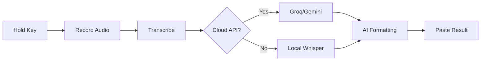

# Verbal

**Voice-to-text, instantly.** Hold a key to record, release to transcribe and paste. Works offline with local AI, or boost accuracy with free cloud APIs.


Verbal is a privacy-focused voice dictation tool that runs in your menu bar/system tray. It's designed for writers, developers, and professionals who want to type faster by speaking naturally.

## 🎯 Product Scope

Verbal solves the problem of slow typing by converting speech to text in real-time with minimal friction. The product scope includes:

### Core Features
- **Instant Dictation**: Hold a key to record, release to transcribe and paste
- **Privacy First**: Local transcription with optional cloud enhancement
- **AI-Powered Formatting**: Automatically format your speech with natural language commands
- **Cross-Platform**: Native apps for macOS and Windows
- **Offline Capability**: Works without internet using local Whisper models
- **Seamless Integration**: Pastes text directly into any application

### Target Users
- **Writers & Content Creators**: Bloggers, authors, journalists who need to capture thoughts quickly
- **Developers & Technical Workers**: Programmers, data scientists who document code and processes
- **Professionals**: Lawyers, doctors, executives who need to create documents efficiently
- **Students**: Researchers, academics who take notes and write papers
- **Anyone**: People who prefer speaking to typing for speed or accessibility

### Use Cases
- Writing emails, documents, and reports
- Coding comments and documentation
- Meeting notes and brainstorming
- Social media posts and messages
- Research and academic writing
- Accessibility for users with motor difficulties

## 🚀 How It Works



1. **Record**: Hold your designated hotkey to capture audio
2. **Transcribe**: Convert speech to text using:
   - Local Whisper models (offline)
   - Groq's Whisper Large V3 (free, cloud)
   - Gemini Flash (free, cloud)
3. **Format**: Apply AI formatting rules to clean up transcription
4. **Paste**: Automatically insert text into your active application

## 🖥️ Cross-Platform Support

Verbal is designed to work seamlessly across different operating systems with native performance and integration.

### macOS
- **System Integration**: Menu bar app with native macOS controls
- **Hotkey**: Right Option key by default (configurable)
- **Permissions**: Requests microphone and accessibility access
- **Installation**: DMG installer or direct .app usage
- **Requirements**: macOS 10.15+ with Python 3.11

### Windows
- **System Integration**: System tray app with Windows-native controls
- **Hotkey**: Right Alt key by default (configurable)
- **Permissions**: Requests microphone access via Windows security
- **Installation**: EXE installer with automatic updates
- **Requirements**: Windows 10+ with Python 3.11

### Linux (Planned)
- **System Integration**: System tray app with GTK/Qt interface
- **Hotkey**: Configurable via settings
- **Installation**: DEB/RPM packages or AppImage
- **Requirements**: Ubuntu 20.04+/Fedora 34+ with Python 3.11

## 🔧 Technology Stack

### Core Components
- **Whisper**: Local speech recognition using faster-whisper
- **Groq**: Cloud Whisper Large V3 for highest accuracy (free tier)
- **Gemini**: AI formatting and enhancement (free tier)
- **PyInstaller**: Cross-platform packaging and distribution
- **Native UI**: rumps (macOS), pystray (Windows)

### Key Libraries
- `faster-whisper`: Optimized local transcription
- `sounddevice`: Cross-platform audio recording
- `groq`: Cloud API integration
- `google-generativeai`: Gemini API access
- `pynput`: Hotkey detection and text injection

## 📦 Installation

### macOS
1. Download the latest `Verbal.dmg` from [Releases](https://github.com/CSshabbar/Verbal/releases)
2. Open the DMG and drag Verbal to your Applications folder
3. Launch Verbal from Applications
4. Grant microphone and accessibility permissions when prompted

### Windows
1. Download the latest `Verbal-Setup.exe` from [Releases](https://github.com/CSshabbar/Verbal/releases)
2. Run the installer and follow the setup wizard
3. Launch Verbal from the Start menu
4. Grant microphone permissions when prompted

### From Source
```bash
# Clone the repository
git clone https://github.com/CSshabbar/Verbal.git
cd Verbal

# Set up Python environment
python3 -m venv .venv
source .venv/bin/activate  # On Windows: .venv\Scripts\activate

# Install dependencies
pip install -r whisperflow/requirements.txt

# Run the application
python3 -m whisperflow.app.main
```

## ⚙️ Configuration

Verbal stores settings in `~/.verbal/config.json`:

```json
{
  "whisper_model": "base",
  "hotkey_hold": 54,
  "hotkey_toggle": 54,
  "groq_api_keys": [],
  "gemini_api_keys": [],
  "recording_mode": "toggle",
  "command_keywords": [
    "make", "fix", "convert", "formal", "casual", 
    "bullet", "summarize", "rephrase", "translate", 
    "shorter", "longer"
  ]
}
```

### API Keys
Get free API keys to enhance accuracy:
- [Groq API Key](https://console.groq.com) - Free, fastest cloud transcription
- [Google AI Studio Key](https://aistudio.google.com/apikey) - Free, for AI formatting

## 🎮 Usage

### Basic Dictation
1. Focus on any text input field
2. Hold your hotkey (Right Option/Alt by default)
3. Speak naturally
4. Release the key to transcribe and paste

### AI Formatting Commands
Include these phrases in your dictation:
- "make this formal"
- "fix grammar"
- "convert to bullet points"
- "summarize this"
- "translate to Spanish"
- "make this casual"
- "make it longer"
- "make it shorter"

### File References
Reference files in your dictation:
- "at file main.py" → @main.py
- "tag config.json" → @config.json

### Menu Bar Controls (macOS)
- **Recording Mode**: Toggle between hold-to-record and toggle modes
- **Whisper Model**: Choose accuracy/speed tradeoff
- **API Keys**: Manage Groq and Gemini API keys
- **History**: View and reuse previous transcriptions
- **Settings**: Configure hotkeys and preferences

## 🔒 Privacy & Security

Verbal is designed with privacy as a core principle:

### Data Handling
- **Local First**: Audio never leaves your device by default
- **No Telemetry**: No usage tracking or analytics
- **Config Storage**: Settings stored locally in `~/.verbal/`
- **Cloud Opt-In**: Cloud APIs only used when you provide keys

### Audio Processing
- Audio is processed in real-time and discarded immediately
- No audio is stored, cached, or transmitted without explicit consent
- Local Whisper models process audio entirely on your device

### API Usage
- Cloud transcription only occurs when you add API keys
- Audio is sent only to services you explicitly configure
- All API communication uses HTTPS encryption

## 🛠️ Development

### Project Structure
```
Verbal/
├── whisperflow/           # Main application code
│   ├── app/               # Core modules
│   │   ├── main.py        # Entry point
│   │   ├── transcriber.py # Speech recognition
│   │   ├── ai_cleanup.py  # Text formatting
│   │   └── config.py      # Settings management
│   ├── assets/            # Icons and UI resources
│   ├── requirements.txt   # Python dependencies
│   └── *.spec             # PyInstaller configurations
├── .github/workflows/     # CI/CD build processes
└── build_exe.sh           # Release automation
```

### Building from Source
```bash
# macOS
cd whisperflow
chmod +x build.sh
./build.sh
# Output: dist/Verbal.app

# Windows
cd whisperflow
pyinstaller verbal-win.spec
# Output: dist/Verbal.exe
```

### Contributing
1. Fork the repository
2. Create a feature branch
3. Commit your changes
4. Push to the branch
5. Create a Pull Request

## 📄 License

This project is licensed under the MIT License - see the [LICENSE](LICENSE) file for details.

## 🙏 Acknowledgments

- [OpenAI Whisper](https://github.com/openai/whisper) for speech recognition
- [Systran/faster-whisper](https://github.com/Systran/faster-whisper) for optimized inference
- [Groq](https://groq.com) for free cloud transcription
- [Google Gemini](https://ai.google.dev) for AI formatting
- [rumps](https://github.com/jaredks/rumps) for macOS menu bar integration

## 📞 Support

For issues, feature requests, or questions:
- Open an issue on [GitHub](https://github.com/CSshabbar/Verbal/issues)
- Check the [Wiki](https://github.com/CSshabbar/Verbal/wiki) for documentation
- Join our community on [Discord](#) (coming soon)